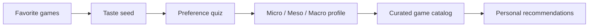

# GameFit

GameFit is a quiz-based guide for finding games that match how someone likes to learn, improve, and spend their time.

## Why I built it

Game recommendations usually focus on genre or popularity, but two games in the same genre can feel completely different. I built GameFit to explore a more personal question: what kind of challenge is actually fun for you?

## How it works

Players name a few games they already enjoy, answer short scenario questions, and receive a profile across three kinds of play:

- **Micro:** execution, timing, aim, and fast feedback.
- **Meso:** adaptation, tactics, and moment-to-moment judgment.
- **Macro:** planning, systems, progression, and long-term strategy.

The result includes a visual profile and recommendations from a curated local catalog.

## Catalog Strategy

MVP 1 intentionally ships with a small reviewed catalog so the app stays fast, explainable, and usable without API keys. Future versions can expand the library through public or free game-data sources:

- **RAWG:** broad game metadata, screenshots, platforms, genres, and discovery fields.
- **IGDB:** rich game database with a free non-commercial API under Twitch terms.
- **Steam Web API:** official Steam app and store-facing data where a Steam API key is appropriate.
- **SteamSpy:** Steam popularity and ownership estimates, useful as a trend signal but not as ground truth.

Imported data should be treated as raw evidence. GameFit still needs its own reviewed skill labels for aim, movement, timing, adaptation, resource planning, friction, session length, and challenge style.

## Architecture



## Run locally

```bash
pnpm install
pnpm dev
```

Run `pnpm test`, `pnpm lint`, and `pnpm build` to verify the project.

## Project status

GameFit is a polished MVP with no account or backend requirements.

See `docs/future-iterations.md` and `docs/ml-pipeline-roadmap.md` for the catalog expansion, analytics, and machine-learning roadmap.
